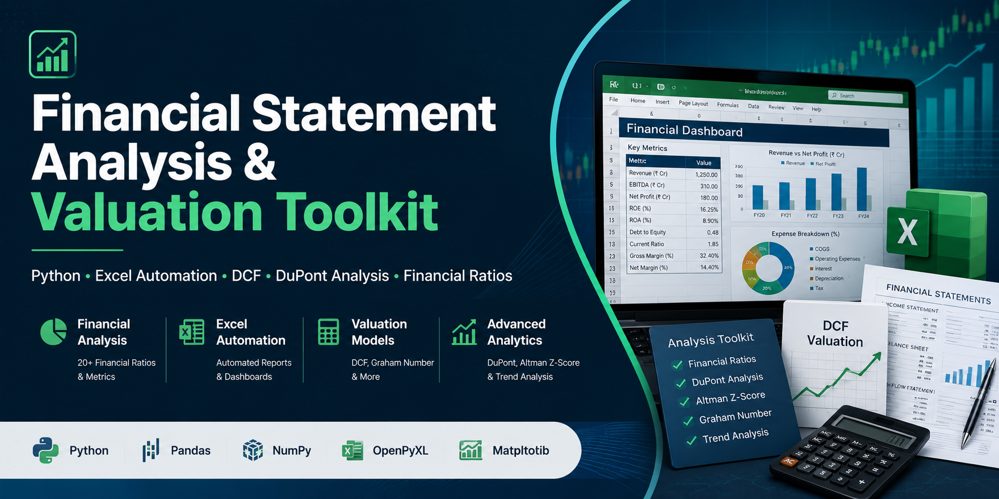

<p align="center">
  
</p>

# 💼 Project 4: Financial Statement Analysis & Valuation Toolkit

Professional equity valuation toolkit...


[](LICENSE)

> **Stack:** Python · Excel (openpyxl) · Pandas · Matplotlib · NumPy

## 📌 Overview
Professional equity valuation toolkit implementing DCF, DuPont, Altman Z-Score, Graham Number, and 20+ financial ratios. Outputs a fully formatted Excel workbook used by equity research analysts.

## 📁 Structure
```
project4_financial_toolkit/
├── scripts/
│   ├── financial_toolkit.py       # Core engine: all valuation models
│   └── 02_build_excel_model.py    # Professional Excel workbook builder
├── excel_models/
│   └── Financial_Valuation_Model.xlsx
└── outputs/
    ├── financial_dashboard.png
    └── TechCorp_India_Ltd_analysis.xlsx
```

## 📊 Modules
| Module | Description |
|--------|-------------|
| Ratio Analysis | 20+ ratios: Profitability, Liquidity, Leverage, Efficiency |
| DCF Valuation | 3-stage model with Bear/Base/Bull scenarios |
| DuPont Analysis | 5-factor RoE decomposition |
| Altman Z-Score | Financial health & bankruptcy prediction |
| Graham Number | Benjamin Graham conservative intrinsic value |

## 🗂️ Excel Sheets
Cover · Income Statement · Balance Sheet · Cash Flow · Ratio Dashboard · DCF Valuation · DuPont · Altman Z-Score

## 🚀 Run
```bash
pip install pandas numpy matplotlib openpyxl
python scripts/financial_toolkit.py
python scripts/02_build_excel_model.py
```

## 🏆 Skills
Python OOP · DCF Valuation · Ratio Analysis · DuPont · Altman Z-Score · Excel Automation (openpyxl) · Matplotlib · Scenario Analysis · Equity Research
